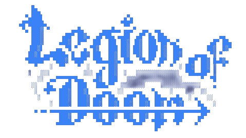

[](https://github.com/zepfietje/starware)

<!-- ALL-CONTRIBUTORS-BADGE:START - Do not remove or modify this section -->
[](#contributors-)
<!-- ALL-CONTRIBUTORS-BADGE:END -->

[![Contributors][contributors-shield]][contributors-url]
[![Forks][forks-shield]][forks-url]
[![Stargazers][stars-shield]][stars-url]
[![Issues][issues-shield]][issues-url]
[![MIT License][license-shield]][license-url]

<br />
<p align="center">
  <a href="https://github.com/legion-cli/legion-cli">
    
  </a>

  <h3 align="center">Legion CLI</h3>

  <p align="center">
    The official repository for the Legion CLI website
    <br />
    <br />
    <a href="https://legioncli.com">View Live</a>
    ·
    <a href="https://github.com/legion-cli/legion-cli/issues">Report Bugs</a>
    .
    <a href="https://github.com/legion-cli/legion-cli/issues">Add Features</a>
  </p>
</p>

<!-- TABLE OF CONTENTS -->
<details open="open">
  <summary>Table of Contents</summary>
  <ol>
    <li>
      <a href="#about-the-project">About The Project</a>
      <ul>
      </ul>
        <li><a href="#built-with">Built With</a></li>
    </li>
    <li>
      <a href="#getting-started">Getting Started</a>
      <ul>
        <li><a href="#prerequisites">Prerequisites</a></li>
        <li><a href="#contribution-guidlines">Contribution guidlines</a></li>
        <li><a href="#local-repository-setup">Local Repository Setup</a></li>
        <li><a href="#running-the-project">Running the project</a></li>
      </ul>
    </li>
    <li><a href="#license">License</a></li>
    <li><a href="#dsc-nit-rourkela">DSC NIT Rourkela</a></li>
    <li><a href="#starware">Starware</a></li>
  </ol>
</details>

## About The Project

Legion CLI is a powerful developer-first command-line tool designed to streamline your development workflow. It brings together talent, innovation, and creativity to solve real-world coding challenges using the latest technologies.

## Built With

Following technologies and libraries are used for the development of this website

- [React]()
- [NextJS]()
- [Tailwind]()
- [Netlify]()

## Getting Started

To setup the project locally the steps below.

### Prerequisites

- [Node.js](https://nodejs.org/en/download/)

  ```sh
  # Homebrew
  brew install nodejs

  # Sudo apt
  sudo apt install nodejs

  # Packman
  pacman -S nodejs

  # Module Install
  dnf module install nodejs:<stream> # stream is the version

  # Windows (chocolaty)
  cinst nodejs.install

  ```

- [Yarn](https://classic.yarnpkg.com/en/docs/install/)

```sh
  npm install --global yarn
```

- [Git](https://git-scm.com/downloads)

```sh
  # Homebrew
  brew install git

  # Sudo apt
  apt-get install git

  # Packman
  pacman -S git

  # Module Install (Fedora)
  dnf install git

```

### Contribution guidlines

`Contributions are welcome 🎉🎉`

NOTE 1: Please abide by the [Contributing Guidelines][contributing-guidelines].

NOTE 2: Please abide by the [Code of Conduct][code-of-conduct].

### Local Repository Setup

Please refer to the project's style and contribution guidelines for submitting patches and additions. In general, we follow the "fork-and-pull" Git workflow.

1.  **Fork** the repo on GitHub
2.  **Clone** the project to your local system
3.  **Commit** changes to your own separate branch
4.  **Push** your work back up to your fork
5.  Submit a **Pull request** so that we can review your changes

### Running the project.

The project uses Yarn and not NPM. It is strictly advised to stick with Yarn so as to avoid dependency conflicts down the line.

```
## Install Dependencies
yarn install

## Run the Project
yarn dev

## Run the build
yarn build

```

## License

Distributed under the MIT License. See `LICENSE` for more information.

## Legion CLI

[![Legion CLI][legion-cli-badge]](https://github.com/legion-cli/legion-cli)

## Starware

legion-cli/legion-cli is Starware.
This means you're free to use the project, as long as you star its GitHub repository.
Your appreciation makes us grow and glow up. ⭐

<!-- MARKDOWN LINKS & IMAGES -->
<!-- https://www.markdownguide.org/basic-syntax/#reference-style-links -->

[contributors-shield]: https://img.shields.io/github/contributors/legion-cli/legion-cli?style=for-the-badge
[contributors-url]: https://github.com/legion-cli/legion-cli/graphs/contributors
[forks-shield]: https://img.shields.io/github/forks/legion-cli/legion-cli?style=for-the-badge
[forks-url]: https://github.com/legion-cli/legion-cli/network/members
[stars-shield]: https://img.shields.io/github/stars/legion-cli/legion-cli?style=for-the-badge
[stars-url]: https://github.com/legion-cli/legion-cli/stargazers
[issues-shield]: https://img.shields.io/github/issues/legion-cli/legion-cli?style=for-the-badge
[issues-url]: https://github.com/legion-cli/legion-cli/issues
[license-shield]: https://img.shields.io/github/license/legion-cli/legion-cli?style=for-the-badge
[license-url]: ./LICENSE
[legion-cli-badge]: public/repoCover.png
[code-of-conduct]: ./CODE_OF_CONDUCT.md
[contributing-guidelines]: ./CONTRIBUTING.md

## Contributors ✨

Thanks goes to these wonderful people ([emoji key](https://allcontributors.org/docs/en/emoji-key)):

<!-- ALL-CONTRIBUTORS-LIST:START - Do not remove or modify this section -->
<!-- prettier-ignore-start -->
<!-- markdownlint-disable -->
<table>
  <tbody>
    <tr>
      <td align="center" valign="top" width="14.28%"><a href="https://ayussh.vercel.app/"><br /><sub><b>Ayush</b></sub></a><br /><a href="https://github.com/legion-cli/legion-cli/commits?author=ayussh-2" title="Code">💻</a></td>
      <td align="center" valign="top" width="14.28%"><a href="https://github.com/mshalom27"><br /><sub><b>Shalom Mendonca</b></sub></a><br /><a href="https://github.com/legion-cli/legion-cli/commits?author=mshalom27" title="Code">💻</a></td>
      <td align="center" valign="top" width="14.28%"><a href="https://github.com/Amphere1"><br /><sub><b>Krishnakant Sahu</b></sub></a><br /><a href="https://github.com/legion-cli/legion-cli/commits?author=Amphere1" title="Code">💻</a></td>
      <td align="center" valign="top" width="14.28%"><a href="https://pratyush-portfolio.vercel.app/"><br /><sub><b>Ptrock2005</b></sub></a><br /><a href="https://github.com/legion-cli/legion-cli/commits?author=PratyushPanda2005" title="Code">💻</a></td>
      <td align="center" valign="top" width="14.28%"><a href="https://github.com/AshutoshMishra1615"><br /><sub><b>AshutoshMishra1615</b></sub></a><br /><a href="https://github.com/legion-cli/legion-cli/commits?author=AshutoshMishra1615" title="Code">💻</a></td>
      <td align="center" valign="top" width="14.28%"><a href="https://github.com/AishwaryJhunjhunwala"><br /><sub><b>AishwaryJhunjhunwala</b></sub></a><br /><a href="https://github.com/legion-cli/legion-cli/commits?author=AishwaryJhunjhunwala" title="Code">💻</a></td>
      <td align="center" valign="top" width="14.28%"><a href="https://github.com/HIMANSHU6001"><br /><sub><b>Himanshu Kaushik</b></sub></a><br /><a href="https://github.com/legion-cli/legion-cli/commits?author=HIMANSHU6001" title="Code">💻</a></td>
    </tr>
    <tr>
      <td align="center" valign="top" width="14.28%"><a href="https://github.com/devsw-prayas"><br /><sub><b>DevSw</b></sub></a><br /><a href="https://github.com/legion-cli/legion-cli/commits?author=devsw-prayas" title="Code">💻</a></td>
      <td align="center" valign="top" width="14.28%"><a href="https://github.com/raaz-tilak"><br /><sub><b>raaz-tilak</b></sub></a><br /><a href="https://github.com/legion-cli/legion-cli/commits?author=raaz-tilak" title="Code">💻</a></td>
      <td align="center" valign="top" width="14.28%"><a href="https://github.com/srikant3691"><br /><sub><b>Srikant Panigrahy</b></sub></a><br /><a href="https://github.com/legion-cli/legion-cli/commits?author=srikant3691" title="Code">💻</a></td>
      <td align="center" valign="top" width="14.28%"><a href="https://portfolioscyy.netlify.app/playground"><br /><sub><b>Ayan</b></sub></a><br /><a href="https://github.com/legion-cli/legion-cli/commits?author=AYANscyy2" title="Code">💻</a></td>
      <td align="center" valign="top" width="14.28%"><a href="https://github.com/Anwesha28S"><br /><sub><b>Anwesha.28</b></sub></a><br /><a href="https://github.com/legion-cli/legion-cli/commits?author=Anwesha28S" title="Code">💻</a></td>
      <td align="center" valign="top" width="14.28%"><a href="https://github.com/SiddhiB-05"><br /><sub><b>SiddhiB-05</b></sub></a><br /><a href="https://github.com/legion-cli/legion-cli/commits?author=SiddhiB-05" title="Code">💻</a></td>
      <td align="center" valign="top" width="14.28%"><a href="https://github.com/Krish-2118"><br /><sub><b>Krish-2118</b></sub></a><br /><a href="https://github.com/legion-cli/legion-cli/commits?author=Krish-2118" title="Code">💻</a></td>
    </tr>
  </tbody>
</table>

<!-- markdownlint-restore -->
<!-- prettier-ignore-end -->

<!-- ALL-CONTRIBUTORS-LIST:END -->

This project follows the [all-contributors](https://github.com/all-contributors/all-contributors) specification. Contributions of any kind welcome!
